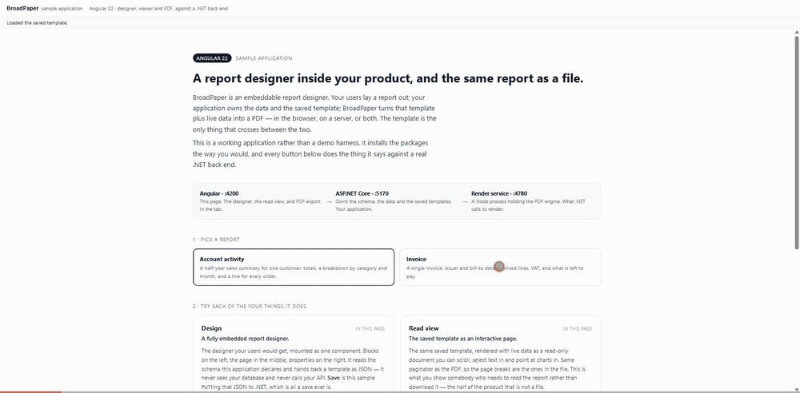

# BroadPaper sample application



**An Angular front end, a React front end, and one .NET Core back end** using
the BroadPaper SDK. A user designs a report in the browser, reads it as a web
page, exports it to PDF there, saves the template to the server, and the server
renders that saved template into the same PDF with no browser anywhere near it.

Pick whichever front end matches your stack:

| | | |
| --- | --- | --- |
| **Angular** | `npm start` | http://localhost:4200 |
| **React** | `npm run start:react` | http://localhost:4300 |

They are the same application twice: same API, same four buttons, same three
render paths. Everything installs from npm and nuget.org, exactly as you would.

## What is in it

| | |
| --- | --- |
| `angular/` | Angular 22, zoneless. Designer, read-only viewer, browser export, and calls to the API. |
| `react/` | React 19 on Vite. The same, in React. |
| `api/` | ASP.NET Core on .NET 10. Owns the data contract, stores saved templates, and renders server-side through `BroadPaper.Client`. |
| `render-service/` | `@broadpaper/server`, the render service the API is a client of. |
| `tools/` | Builds the starter templates with `@broadpaper/core`. |
| `scripts/start.mjs` | Starts the render service, the API and one front end, and stops them together. |
| `scripts/vendor.mjs` | Optional. Installs a *local* SDK build over the published one, for trying a change before releasing it. |

Two reports are defined, in `api/data`:

- **Account activity** — a half-year sales summary. KPIs, a bar chart against
  target, a donut by category, and a table of every order that runs onto a
  second page and repeats its header.
- **Invoice** — issuer and bill-to blocks, priced lines, VAT, and a balance due.

Adding a third is a folder with a `schema.json` and a `data.json` in it, plus a
line in `reports.json`. No C# changes.

## Three processes

The .NET client does not render PDFs. It is an HTTP client for the render
service, a Node process that owns the engine — which is how a .NET application
produces these files without a browser, a JavaScript runtime, or a native PDF
library on the server.

```
Angular (:4200)
      or          ──►  ASP.NET Core API (:5170)  ──►  render service (:4780)
React (:4300)           templates, data,              the PDF engine
 designer, viewer,       BroadPaper.Client
 browser export
```

The browser export path skips the middle entirely: the same engine, compiled to
WebAssembly, runs in the tab.

## Running it

You need **Node 22.22.3+, 24.15+ or 26+** plus the **.NET 10 SDK**.

```bash
npm --prefix angular install   # or react, whichever you want
npm --prefix tools run seed    # starter templates, so page one is not blank
npm start                      # Angular, on :4200
npm run start:react            # or React, on :4300
```

One front end at a time. Whichever you start, the render service and the .NET
API come up with it. Or run the three separately, one per terminal:

```bash
cd render-service && BROADPAPER_TOKEN=dev npm start
BroadPaper__Token=dev dotnet run --project api/SampleApi.csproj --urls http://127.0.0.1:5170
cd angular && npm start        # or: cd react && npm start
```

Either front end opens on an overview: what BroadPaper is, the three processes,
and a card per capability. The designer is one click away.

### What to try

1. **Read view.** The saved template as a read-only page. Same paginator as the
   PDF, so the page breaks are the ones in the file.
2. **Export in the browser.** Draws the PDF in the tab with WebAssembly. Stop
   the other two processes and it still works.
3. **Render on the server.** Asks the API for the file. It renders the template
   that was last *saved*, which is why the button warns about unsaved changes.
4. **Change something, Save, then render on the server.** Rotating the page to
   landscape is the quickest proof the round trip is real.
5. **Switch reports.** The invoice has an entirely different schema, and the
   designer's field pickers change with it.

PDFs carry the evaluation watermark because no licence is configured. Set
`BROADPAPER_LICENSE` on the render service and it goes away.
